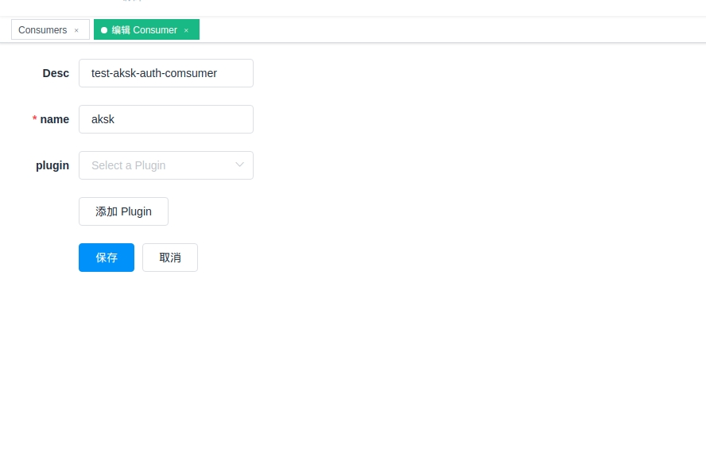
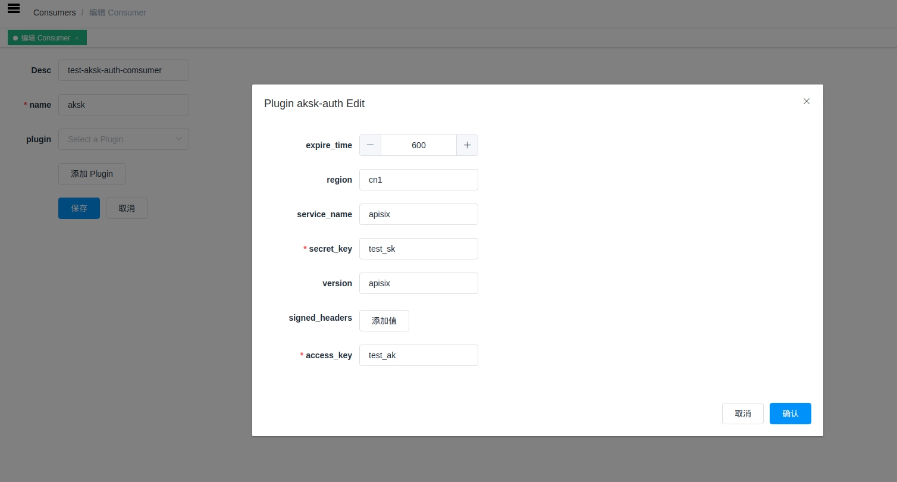

<!--
#
# Licensed to the Apache Software Foundation (ASF) under one or more
# contributor license agreements.  See the NOTICE file distributed with
# this work for additional information regarding copyright ownership.
# The ASF licenses this file to You under the Apache License, Version 2.0
# (the "License"); you may not use this file except in compliance with
# the License.  You may obtain a copy of the License at
#
#     http://www.apache.org/licenses/LICENSE-2.0
#
# Unless required by applicable law or agreed to in writing, software
# distributed under the License is distributed on an "AS IS" BASIS,
# WITHOUT WARRANTIES OR CONDITIONS OF ANY KIND, either express or implied.
# See the License for the specific language governing permissions and
# limitations under the License.
#
-->

# Summary
- [**Name**](#name)
- [**Attributes**](#attributes)
- [**How To Enable**](#how-to-enable)
- [**Test Plugin**](#test-plugin)
- [**Disable Plugin**](#disable-plugin)


## Name

`aksk-auth` is an authentication plugin that need to work with `consumer`. Add AK/SK  Authentication to a `service` or `route`.

The `consumer` then adds its key to  request header to verify its request.

For more information on AK/SK authentication, refer to [AK/SK](https://docs.aws.amazon.com/zh_cn/general/latest/gr/signature-version-4.html) for more information.

## Attributes

|Name          |Requirement  |Description|
|---------     |--------|-----------|
| access_key         |required|different `consumer` have different value, it's unique. different `consumer` use the same `key`, and there will be a request matching exception.|
| secret key      |required|encryption key. |
| region    |  optional|Service Region, default is ""|
| version          |optional|custom signature Version, default is "apisix"|
| service_name          |optional|Service Name, default is ""|
| expire_time|optional|Legal time frame of the request, default value is 600.  expire_time < server_now_timestamp - request_timestamp < 3600 |

## How To Enable

1. set a consumer and config the value of the `aksk-auth` option

```shell
curl http://127.0.0.1:9080/apisix/admin/consumers -H 'X-API-KEY: edd1c9f034335f136f87ad84b625c8f1' -X PUT -d '
{
    "username": "aksk",
    "plugins": {
        "aksk-auth": {
            "expire_time":600,
            "access_key":"asdfasdfsadfasdf",
            "secret_key":"asdfasfasdfasdfasdf",
            "region": "",
            "version":"apisix",
            "service_name":""
        }
    }
}'
```

you can visit Dashboard `http://127.0.0.1:9080/apisix/dashboard/` and add a Consumer through the web console:



then add aksk-auth plugin in the Consumer page:


2. add a Route or add a Service , and enable the `aksk-auth` plugin

```shell
curl http://127.0.0.1:9080/apisix/admin/routes/1 -H 'X-API-KEY: edd1c9f034335f136f87ad84b625c8f1' -X PUT -d '
{
    "methods": ["GET"],
    "uri": "/index.html",
    "plugins": {
        "aksk-auth":{
            "expire_time":600,
            "access_key":"asdfasdfsadfasdf",
            "secret_key":"asdfasfasdfasdfasdf",
            "region": "",
            "version":"apisix",
            "service_name":""
        }
    },
    "upstream": {
        "type": "roundrobin",
        "nodes": {
            "127.0.0.1:80": 1
        }
    }
}'
```

## Test Plugin

* request header with ak/sk:

```shell
$ curl http://127.0.0.1:9080/index.html -H 'Authorization: APISIX-HMAC-SHA256 20200910T064011Z=test_user_ak/20200910/cn1/apisix/apisix_request, SignedHeaders=host;x-amz-date, Signature=bf9497dc1276cf6cf7e61864591f7d238f5a6855b0b5cef9aa0c4d811e7d90f1' -H 'x-amz-date: 20200910T055739Z' -i
HTTP/1.1 200 OK
Content-Type: text/html
Content-Length: 13175
...
Accept-Ranges: bytes

<!DOCTYPE html>
<html lang="cn">
...
```


## Disable Plugin

When you want to disable the `aksk-auth` plugin, it is very simple,
 you can delete the corresponding json configuration in the plugin configuration,
  no need to restart the service, it will take effect immediately:

```shell
$ curl http://127.0.0.1:2379/v2/keys/apisix/routes/1 -X PUT -d value='
{
    "methods": ["GET"],
    "uri": "/index.html",
    "id": 1,
    "plugins": {},
    "upstream": {
        "type": "roundrobin",
        "nodes": {
            "127.0.0.1:80": 1
        }
    }
}'
```
